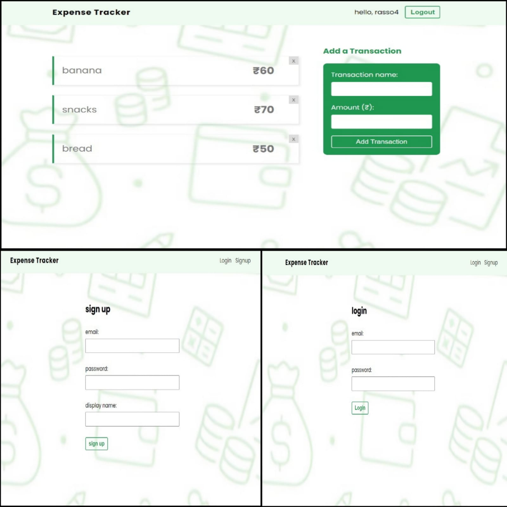

# expense-tracker App
[Live](https://expense-tracker-42373.web.app/login)

## This is preview

## expense-tracker

This app is a project built using React and Firebase, where users can manage their tasks or data through Firebase’s cloud-based services. It integrates Firebase Authentication for user login and registration, and Firestore for real-time data storage and retrieval. Additionally, it demonstrates handling asynchronous operations, CRUD functionality, and deploying the app on Firebase. It's designed to be a comprehensive project management tool with a simple and intuitive interface, making it easy to track and manage tasks.
